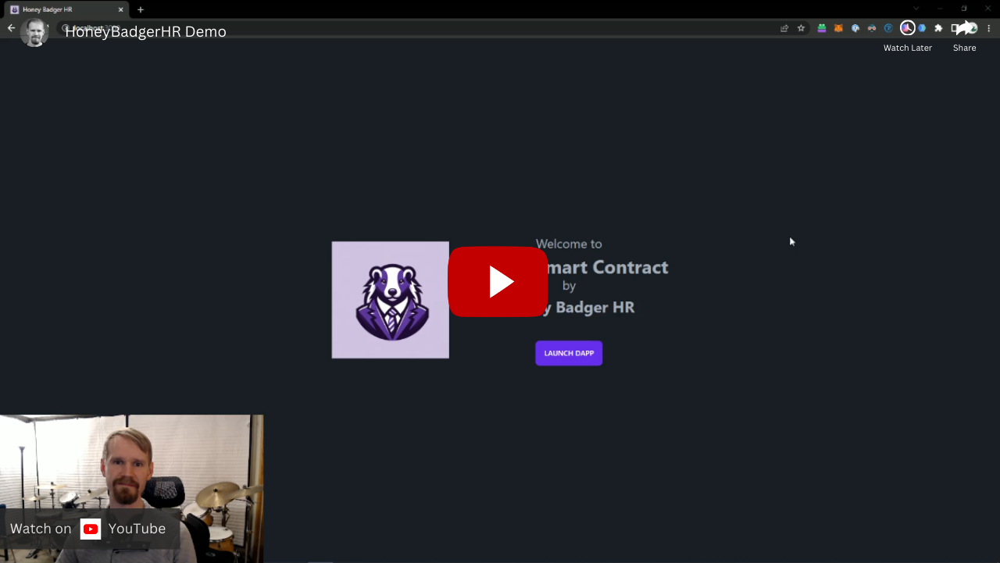

<a hrel="https://www.youtube.com/watch?v=BrkgqdQXIII" align="center" target="_blank">
    
</a>
<br>

# HoneyBadgerHR & MVMT Payroll

HoneyBadgerHR introduces the MVMT Payroll system, a Web3 solution that modernizes payroll processes using blockchain technology. This system empowers employers with flexible payroll management and incentivizes employees through an innovative KPI Raffle System.

# MVMT Payroll Smart Contract

The MVMT Payroll Smart Contract is designed to allow employers to execute payroll on multiple chains, providing employees the freedom to receive their earnings on any supported blockchain. This flexibility ensures that payroll can adapt to the diverse preferences of a global workforce.

# Raffle Smart Contract

The Raffle Smart Contract is developed as a tool for employee engagement, allowing companies to hold raffles and reward employees. This feature aims to boost morale and encourage productivity by offering incentives in the form of digital assets.

# Technologies Used

- Scaffold-ETH-3: Our project is built on top of Scaffold-ETH-3, which provided us with a robust development framework to create Ethereum-based applications efficiently.
- Dashboard Template (https://github.com/srobbin01/daisyui-admin-dashboard-template): The user interface leverages the daisyUI admin dashboard template, which offers a clean and modern UI for our front-end.
- Chainlink CCIP: Payroll.sol & TonkenTransferor.sol use CCIP to send tokens across chains
- Chainlink VRF & Automation: Raffle.sol pulls a random number from VRF to pick a winner of the raffle and is set up with Automation to pull the random number automatically once a raffle has ended.

## Quick Start

To get started with HoneyBadgerHR:

```
# Clone the repository
git clone https://github.com/your-repo-link

# Install dependencies
yarn install

# Start the development server
yarn start

```
